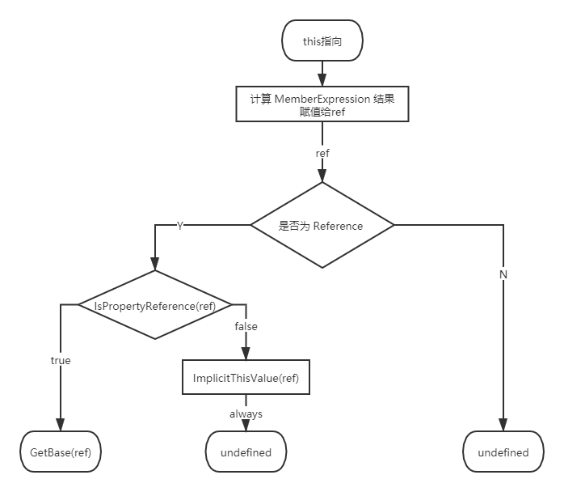

 > 本文摘自[JavaScript深入之从ECMAScript规范解读this](https://github.com/mqyqingfeng/Blog/issues/7)

## Types

ECMAScript 的类型分为语言类型和规范类型。

   * 语言类型：开发者直接使用 ECMAScript 可以操作的，即六大基本类型。
   * 规范类型：用来用算法描述 ECMAScript 语言结构和 ECMAScript 语言类型的。规范类型包括：Reference, List, Completion, Property Descriptor, Property Identifier, Lexical Environment, 和 Environment Record。

要搞懂 this 的指向问题，我们需要先了解其中的 Reference 类型。

### Reference

什么是Reference？

看一下 ECMA-262/5.1 的定义

   > The Reference type is used to explain the behaviour of such operators as delete, typeof, and the assignment operators.
    
一个引用由三部分组成

   1. base value：可以是 undefined, Object, Boolean, String, Number, 或 environment record。
   2. referenced name： String
   3. strict reference flag： Boolean 
   
简单理解为：

```javascript
var foo = {
    bar: function () {
        return this;
    }
};
 
foo.bar(); // foo

// bar对应的Reference是：
var BarReference = {
    baseValue: foo,
    referencedName: 'bar',
    strictReferenceFlag: false
};
```

规范中还提供了获取 Reference 组成部分的方法，比如 GetBase 和 IsPropertyReference。

### GetValue

返回 reference 的 base value。

简单模拟 GetValue 的使用：

```javascript
var foo = 1;

var fooReference = {
    base: EnvironmentRecord,
    name: 'foo',
    strict: false
};

GetValue(fooReference) // 1;
```

GetValue 返回对象属性真正的值，但是要注意：

**调用 GetValue，返回的将是具体的值，而不再是一个 Reference**

### IsPropertyReference

简单的理解：如果 base value 是一个对象，就返回true。


## 确定this指向

根据 ECMA-262/5.1 11.2.3 Function Calls

  If Type(ref) is Reference, then
       
   * If IsPropertyReference(ref) is true, then
   
         Let thisValue be GetBase(ref).
         
   * Else, the base of ref is an Environment Record
   
         Let thisValue be the result of calling the ImplicitThisValue concrete method of GetBase(ref).
   
Else, Type(ref) is not Reference.

    Let thisValue be undefined.


概括为

1. 计算 MemberExpression 的结果赋值给 ref

2. 判断 ref 是不是一个 Reference 类型

        2.1 如果 ref 是 Reference，并且 IsPropertyReference(ref) 是 true, 那么 this 的值为 GetBase(ref)

        2.2 如果 ref 是 Reference，并且 base value 值是 Environment Record, 那么this的值为 ImplicitThisValue(ref)，此函数总是返回 undefined

        2.3 如果 ref 不是 Reference，那么 this 的值为 undefined
        
### MemberExpression

参考 11.2 Left-Hand-Side Expressions

 MemberExpression :

 * PrimaryExpression // 原始表达式 可以参见《JavaScript权威指南第四章》
 * FunctionExpression // 函数定义表达式
 * MemberExpression [ Expression ] // 属性访问表达式
 * MemberExpression . IdentifierName // 属性访问表达式
 * new MemberExpression Arguments // 对象创建表达式
 
 例如：
 ```javascript
function foo() {
    console.log(this)
}

foo(); // MemberExpression 是 foo

function foo() {
    return function() {
        console.log(this)
    }
}

foo()(); // MemberExpression 是 foo()

var foo = {
    bar: function () {
        return this;
    }
}

foo.bar(); // MemberExpression 是 foo.bar
```

所以简单理解 MemberExpression 其实就是()左边的部分。

**因此关键就在于看规范是如何处理各种 MemberExpression，返回的结果是不是一个 Reference 类型。**

补充判断逻辑流程图：



例子：

```javascript
var value = 1;

var foo = {
  value: 2,
  bar: function () {
    return this.value;
  }
}

//示例1
console.log(foo.bar()); // 2
//示例2
console.log((foo.bar)()); // 2
//示例3
console.log((foo.bar = foo.bar)()); // 1
//示例4
console.log((false || foo.bar)()); // 1
//示例5
console.log((foo.bar, foo.bar)()); // 1
```

### 补充

在刚学习JavaScript时只是死记 this 为调用函数的对象，但对于如下例子无法解释：

```javascript
var value = 1;

var foo = {
  value: 2,
  bar: function () {
    return this.value;
  }
}
console.log((false || foo.bar)()); // 1
```

之前听死月大佬讲node的时候就了解到很多问题其实 ECMA-262 规范中就说明的很清楚了，在准备面试和基础知识时如果只是一味的死记硬背或刷题，
效果往往很差，深入原理，懂得原理则不变应万变。
